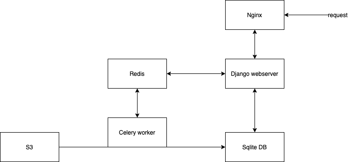
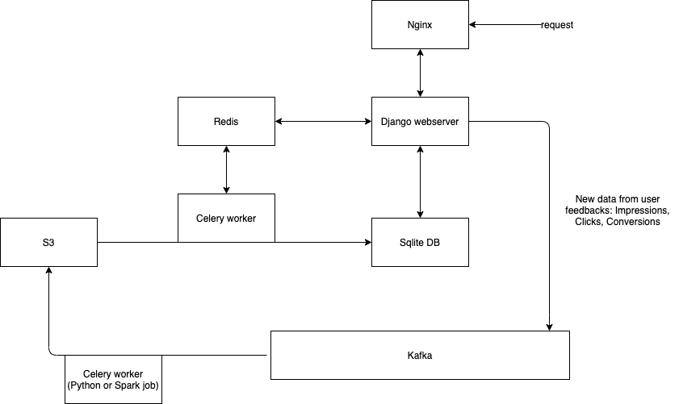

# BannerService

BannerService is online banner serving application based on historical data.

## Design


#### Nginx: 
We use Nginx as web server as it has well know features such as high speed.

#### Django:
 We use Django framework for developing web app and the main logic because it's easy to develop and it has some good features such ORMs, logging, ...

#### Sqlite:
It's django's default database and it's quite simple and lite. It works well for small scale data in our project.
We keep data in 3 tables:
- Impression: keeps impression records as [banner_id, campaign_id, quarter]
- Click: keeps click records as [click_id, banner_id, campaign_id, quarter]
- Conversion: keeps conversion records as [conversion_id, click_id, revenue, quarter]

You can see that we stored the data from all 4 provided datasets into single table by adding another 'quarter' field that indicates the dataset_number(quarter to show). This make the logic of code to be much cleaner as we have to keep just one table for each above set of records and also write querys just for a single table by filtering the quarter field on each request.

#### Redis:
 It's used for django's cache db and also session store (and also for celery worker db). We wanted to prevent showing the same banner to a single visitor in consecutive visits, so we have to keep the banners provided for last visit of every visitor until it's session is active.
It's handled by keeping key:value of visitor_session:last_banners in the Redis db. As Redis is in memory we can retrieve visitors last banners very quickly and handle the rest of work to prevent showing them same banners.

#### S3:
The source csv dataset and banner images are stored in S3.

#### Celery worker:
 The celery worker gets the data and banner images based on a scheduled time(here we used every 12 hours) and runs data_loader.py.
This will loads new data into Sqlite db's 3 predefined tables. This job also checks data records and if there is a duplicate record, it won't insert it into db and also writes some logs into log file.  


## Logic:
On each request we query our Sqlite db and provide the banners based on 4 different scenarios that were mentioned in the doc.
The tests for all scenarios are provided in Unit Test.
We also provided tests for loading duplicate data and unique visitor consecutive visits. 

Logging feature is provided for different parts of application such as data loader job log and duplicate records.

## Stress Test:
We tested our response time and handled requests per minute by ab command. You can see that the application serves 7466 requests per minute. The results are as below:

>This is ApacheBench, Version 2.3 <$Revision: 1879490 $>
Copyright 1996 Adam Twiss, Zeus Technology Ltd, http://www.zeustech.net/
Licensed to The Apache Software Foundation, http://www.apache.org/

>Benchmarking 127.0.0.1 (be patient)
Completed 5000 requests
Finished 7466 requests


>Server Software:        WSGIServer/0.2
Server Hostname:        127.0.0.1
Server Port:            8000

>Document Path:          /
Document Length:        535 bytes

>Concurrency Level:      2
Time taken for tests:   60.019 seconds
Complete requests:      7466
Failed requests:        0
Total transferred:      6980710 bytes
HTML transferred:       3994310 bytes
Requests per second:    124.39 [#/sec] (mean)
Time per request:       16.078 [ms] (mean)
Time per request:       8.039 [ms] (mean, across all concurrent requests)
Transfer rate:          113.58 [Kbytes/sec] received

>Connection Times (ms)
              min  mean[+/-sd] median   max
Connect:        0    0   0.2      0      16
Processing:    12   16   3.7     15      68
Waiting:       11   15   3.5     15      67
Total:         12   16   3.7     15      68

>Percentage of the requests served within a certain time (ms)
  50%     15
  66%     16
  75%     17
  80%     17
  90%     19
  95%     21
  98%     24
  99%     31
 100%     68 (longest request)


## Deployment:
Be sure you have docker installed on your machine.
Pull the repo and simply run:
```sh
docker-compose up -d
```

### You can visit website [HERE]! 

[HERE]: <http://ec2-3-140-240-227.us-east-2.compute.amazonaws.com/>


## Future Steps:
Based on users reactions to served banners, new data will be export to Kafka and again a scheduled job will write new data in batch to S3. So future design would be like this:


